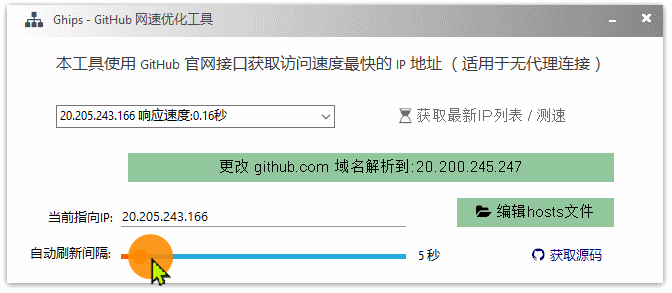

# Ghips | 
GitHub 网速优化工具。  
使用 GitHub 官方 API 获取当前系统访问速度最快的 IP ，并更新 hosts 文件。  

>[&gt;&gt;点这里下载 Ghips](https://github.com/aardio/Ghips/releases/latest/download/Ghips.7z) 体积仅 601 KB [&gt;&gt; 国内镜像](https://gitcode.net/aardio/Ghips/)  
支持 Win7，Win8，Win10，Win11 等操作系统。   




刷新间隔时间设为非 0 则定时获取最快 IP 并自动刷新域名解析。
>更新 IP 后首次访问 GitHub 可能会略慢，稍等就快了。 

本程序需要以管理权限运行才能修改 hosts。  
建议右键点 Ghips 托盘图标，在弹出菜单中勾选「开机启动」。


这样开机就会静默获取管理权限启动，不会再弹出警告。

访问速度快的 IP 经常变更，单击 Ghips 托盘图标能快速刷新 IP 测速结果。   

 
本软件使用 [aardio 编程语言 ](https://www.aardio.com) 开发，早于 2019 年 就在 aardio 中发布了源代码（现已分离为 Ghips 项目）。


调用 GitHub API 的方法请参考：  
[《魔法 web.rest ：自动封装任意 HTTP 接口为本地函数》](https://mp.weixin.qq.com/s/4mYRDnO49alwpQoBD_cILg)

修改 hosts 文件的文件夺权这些比较麻烦，
不过用 aardio 做这事很简单，关键源码如下：
```javascript
fsys.hosts.ownCacls();
fsys.hosts.update(githubIps)
```

用 aardio 实现软件开机静默获取管理权限也很简单，关键源码：
```javascript
import sys.runAsTask;
var sysTask = sys.runAsTask("Ghips","GitHub 优化与修复工具")
sysTask.register("/tray");
```

添加定时器自动刷新 IP 的关键源码如下：
```javascript
winform.setInterval( 
	function(){
		if(!winform.plusUpdateIps.disabled){
			winform.plusUpdateIps.oncommand(,,true);
		}
	},interval * 5000 
)
```

